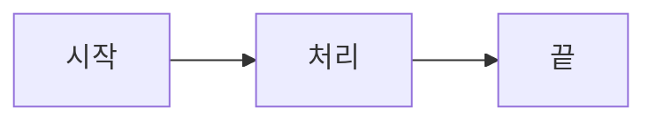

## 제목 예시

일반 텍스트 단락입니다. **볼드**, *이탤릭*, ~~취소선~~, `인라인 코드` 등을 사용할 수 있습니다.

### 링크

- [내부 링크](/blog)
- [외부 링크](https://example.com) — 자동으로 새 탭에서 열림

### 이미지


> 이미지 클릭 시 줌 모달이 열립니다.

### 코드 블록

```ts title="example.ts"
function hello(name: string): string {
  return `Hello, ${name}!`;
}
```

#### 라인 하이라이트

```ts {2-3}
const a = 1;
const b = 2; // 하이라이트됨
const c = 3; // 하이라이트됨
const d = 4;
```

### 인용문

> 인용문은 이렇게 작성합니다.

### 리스트

- 순서 없는 리스트
- 항목 2
  - 중첩 항목

1. 순서 있는 리스트
2. 항목 2

### 테이블

| 항목 | 설명 |
|------|------|
| A    | 설명A |
| B    | 설명B |

### 체크리스트 (GFM)

- [x] 완료된 항목
- [ ] 미완료 항목

### Mermaid 다이어그램



### 구분선

---

본문 끝.
