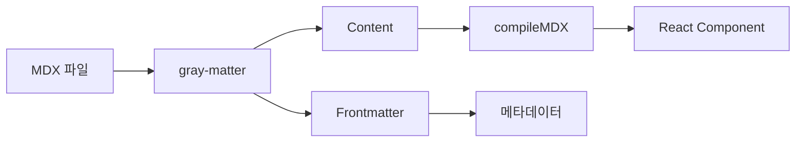

## 시작

안녕하세요! 이 블로그는 개발하면서 배운 것들을 기록하기 위해 만들었습니다.

## 기술 스택

이 블로그는 다음 기술로 만들어졌습니다:

- **Next.js 15** — App Router와 React Server Components
- **Tailwind CSS v4** — 유틸리티 퍼스트 스타일링
- **MDX** — 마크다운 + React 컴포넌트
- **Shiki** — 코드 구문 강조

## 코드 예시

TypeScript로 간단한 함수를 작성해 보겠습니다:

```typescript title="greet.ts" {2}
function greet(name: string): string {
  return `안녕하세요, ${name}님!`;
}

console.log(greet("세계"));
```

Python도 지원합니다:

```python title="fibonacci.py" {2-3,7}
def fibonacci(n: int) -> list[int]:
    """피보나치 수열 생성"""
    if n <= 0:
        return []
    seq = [0, 1]
    while len(seq) < n:
        seq.append(seq[-1] + seq[-2])
    return seq[:n]

print(fibonacci(10))
```

CSS나 JSX 등 다양한 언어를 지원합니다:

```css title="globals.css" {2}
body {
  font-family: "Pretendard Variable", sans-serif;
  line-height: 1.75;
}
```

## 다이어그램

Mermaid 다이어그램도 지원합니다:



## 앞으로

앞으로 다양한 주제에 대해 글을 작성할 예정입니다:

1. 웹 개발 팁과 트릭
2. 시스템 설계
3. 오픈소스 프로젝트 경험
4. 개발자 도구 리뷰

읽어주셔서 감사합니다!
