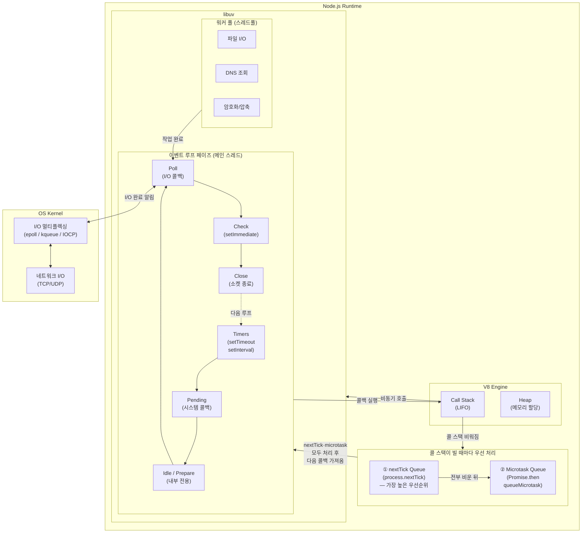

## 개요

처음에 Node.js 이벤트 루프를 어중간하게 배우고 첫 회사에 면접을 보러갔던 기억이 떠오릅니다. 브라우저의 이벤트 루프와 Node.js의 이벤트 루프를 정확히 구분하여 이해하지 못하고 둘을 헷갈린 상태로 면접에 들어갔고 이벤트 루프 관련 질문이 깊게 들어오자 당황했던 기억이 있습니다. 어느 정도 연차가 쌓이고 지속적으로 이벤트 루프에 대해 학습하고 경험하다보니 좀 더 쉽게 정리하여 여러 사람에게 도움이 되었으면 해서 글을 씁니다.

특히, 많은 글에서 Web API를 통한 브라우저의 비동기 처리와 Node.js의 비동기 처리 구현 방식이 차이가 있어 서로 용어가 혼재되어 설명하고 있는 자료들도 있어 이 부분에서 혼선을 제거하고자 했습니다.

이 글은 Node.js 공식 문서의 내용을 번역·취합하고, 약간의 개인적인 의견을 첨가하여 작성되었습니다.

## 블로킹과 논블로킹

이벤트 루프를 이해하기 전에, 블로킹과 논블로킹의 차이를 먼저 짚고 넘어가겠습니다.

**블로킹(Blocking)** 은 현재 작업이 완료될 때까지 다음 작업을 실행하지 못하고 기다리는 것입니다. 예를 들어 파일을 동기적으로 읽으면, 파일 읽기가 끝날 때까지 그 아래 코드는 실행되지 않습니다.

```javascript
const fs = require('node:fs');

// 블로킹: 파일 읽기가 끝날 때까지 다음 줄로 넘어가지 않음
const data = fs.readFileSync('/path/to/file');
console.log(data); // 파일 읽기 완료 후 실행
console.log('다음 작업'); // 그 다음 실행
```

**논블로킹(Non-blocking)** 은 작업을 요청만 해두고 완료를 기다리지 않고 바로 다음 코드를 실행하는 것입니다. 작업이 완료되면 콜백을 통해 결과를 받습니다.

```javascript
const fs = require('node:fs');

// 논블로킹: 파일 읽기를 요청하고 바로 다음 줄로 넘어감
fs.readFile('/path/to/file', (err, data) => {
  console.log(data); // 파일 읽기 완료 후 콜백으로 실행
});
console.log('다음 작업'); // 파일 읽기 완료를 기다리지 않고 먼저 실행
```

Node.js는 I/O 작업(파일, 네트워크, DB 등)을 논블로킹 방식으로 처리합니다. 이것이 싱글 스레드임에도 높은 동시성을 가질 수 있는 이유이며, 이를 가능하게 하는 핵심 메커니즘이 바로 **이벤트 루프** 입니다.

## Node.js 이벤트 루프

Node.js는 **메인 스레드 1개(이벤트 루프)** 와 **워커 풀(Worker Pool) k개** 로 구성됩니다. JavaScript 코드는 메인 스레드에서 실행되므로 "싱글 스레드"라 하지만, 파일 I/O · DNS 조회 · 암호화 등 비용이 큰 작업은 내부적으로 libuv의 워커 풀(스레드풀)에서 병렬로 처리됩니다.

자바스크립트 엔진으로는 V8을 사용하고, 비동기 I/O 처리를 위해 libuv 라이브러리를 사용합니다.

아래 다이어그램은 Node.js 내부 구조를 컴포넌트 수준에서 표현한 것입니다.



### 콜 스택

V8은 Google이 개발한 오픈소스 자바스크립트 엔진으로, 자바스크립트 코드를 기계어로 컴파일하고 실행하는 역할을 합니다. Node.js는 이 V8 엔진 위에서 동작합니다.

V8 내부에는 **콜 스택(Call Stack)** 이 존재합니다. 콜 스택은 현재 실행 중인 함수와 그 함수가 끝난 뒤 돌아갈 위치를 추적하는 데이터 구조입니다. 자바스크립트는 싱글 스레드 언어이므로 콜 스택은 하나만 존재하며, 한 번에 하나의 작업만 처리할 수 있습니다. 이름에서 알 수 있듯이 LIFO(Last In, First Out) 구조로, 가장 나중에 호출된 함수가 가장 먼저 완료됩니다.

다음 코드를 통해 콜 스택의 동작 과정을 살펴보겠습니다.

```javascript
function first() {
  second();
  console.log("첫 번째 함수 종료");
}

function second() {
  console.log("두 번째 함수 실행 중");
}

first();
```

`first()`가 호출되면 콜 스택은 아래와 같은 순서로 변화합니다.

| 단계 | 동작 | 콜 스택 (top → bottom) |
|:---:|------|----------------------|
| 1 | `first()` 호출 | `first` |
| 2 | `first` 내부에서 `second()` 호출 | `second` → `first` |
| 3 | `second` 내부에서 `console.log` 실행 | `console.log` → `second` → `first` |
| 4 | `console.log` 완료 후 pop | `second` → `first` |
| 5 | `second` 반환 후 pop | `first` |
| 6 | `first` 내부에서 `console.log` 실행 | `console.log` → `first` |
| 7 | `console.log` 완료 후 pop | `first` |
| 8 | `first` 반환 후 pop | *(비어있음)* |

함수가 호출되면 스택에 **push**, 반환되면 **pop** 됩니다. 모든 함수가 반환되면 콜 스택이 비게 되고 프로그램이 종료됩니다.

### libuv

libuv는 비동기 I/O 라이브러리입니다. Node.js의 이벤트 루프는 libuv를 통해 비동기 I/O를 처리합니다.

libuv는 비동기 작업을 처리할 때 두 가지 경로를 사용합니다.

- **커널에 위임** — OS 커널이 자체적으로 비동기를 지원하는 작업은 커널에 직접 맡기고, 완료 알림을 받습니다. **네트워크 I/O** (TCP/UDP 소켓, HTTP 요청 등)가 대표적입니다. 커널의 I/O 멀티플렉싱(`epoll`, `kqueue`, `IOCP`)을 활용하므로 별도의 스레드가 필요 없습니다.
- **워커 풀 사용** — OS가 비동기 인터페이스를 제공하지 않는 작업은 libuv의 스레드풀(기본 4개, `UV_THREADPOOL_SIZE` 로 조절 가능)에서 처리합니다. **파일 시스템 I/O**, **DNS 조회** (`dns.lookup()`), **암호화** (`crypto.pbkdf2()` 등), **압축** (`zlib`) 이 해당합니다.

이벤트 루프의 상세 구현은 이 libuv에서 담당하며 아래와 같은 페이즈들이 존재합니다.

- Timers
- Pending
- Idle / Prepare *(내부 전용 — 개발자가 직접 콜백을 등록할 수 없음)*
- Poll
- Check
- Close

각 페이즈는 처리할 콜백의 큐를 가지고 있으며, 이벤트 루프가 해당 페이즈에 진입하면 큐의 콜백을 실행합니다.

이때 일부 페이즈에는 **시스템 실행 한도(system-dependent hard limit)** 가 적용됩니다. Poll 페이즈에서 한 번에 가져올 수 있는 I/O 이벤트 수, Timers 페이즈에서 한 번에 처리하는 만료 타이머 수 등이 이에 해당합니다. 한도에 도달하면 큐에 콜백이 남아있더라도 다음 페이즈로 넘어가고, 남은 콜백은 다음 루프에서 처리됩니다. 이는 한 페이즈가 이벤트 루프를 독점하여 다른 페이즈가 기아 상태(starvation)에 빠지는 것을 방지하기 위함입니다.

반면 Check, Close 같은 페이즈는 큐에 등록된 콜백을 모두 실행한 뒤 다음 페이즈로 넘어갑니다.

#### Timers
Timers 페이즈는 `setTimeout()` 과 `setInterval()` 로 등록된 콜백을 실행합니다. 여기서 중요한 점은 타이머에 지정한 시간은 **"정확한 실행 시각"** 이 아니라 **"최소 대기 시간(threshold)"** 이라는 것입니다. 지정한 시간이 지난 후 가능한 빨리 콜백을 실행하지만, OS 스케줄링이나 다른 콜백의 실행으로 인해 실제 실행은 더 늦어질 수 있습니다.

Timers 페이즈에 등록된 타이머는 **min-heap(최소 힙)** 으로 관리됩니다. 만료 시각이 가장 이른 타이머가 힙의 루트에 위치하므로, 항상 가장 빨리 만료된 타이머부터 처리합니다. 실행 가능한 타이머가 없다면 다음 페이즈로 넘어갑니다.

또한 타이머의 실행 시점은 실제로 Poll 페이즈가 제어합니다. 다음 예시를 보겠습니다.

```javascript
const fs = require('node:fs');

function someAsyncOperation(callback) {
  // 파일 읽기에 95ms가 걸린다고 가정
  fs.readFile('/path/to/file', callback);
}

const timeoutScheduled = Date.now();

setTimeout(() => {
  const delay = Date.now() - timeoutScheduled;
  console.log(`${delay}ms have passed since I was scheduled`);
}, 100);

// 95ms가 걸리는 비동기 작업 실행
someAsyncOperation(() => {
  const startCallback = Date.now();
  // 10ms 동안 동기 작업 수행
  while (Date.now() - startCallback < 10) {
    // do nothing
  }
});
```

이벤트 루프가 Poll 페이즈에 진입하면 큐가 비어있으므로(`fs.readFile()` 이 아직 완료되지 않음) 가장 가까운 타이머의 threshold까지 대기합니다. 95ms가 지나 `fs.readFile()` 이 완료되면 해당 콜백(10ms 소요)이 Poll 큐에 추가되어 실행됩니다. 콜백이 끝난 후 큐가 비면 이벤트 루프는 가장 가까운 타이머의 threshold에 도달했음을 확인하고 Poll 페이즈를 종료합니다. 이후 Check → Close 페이즈를 순서대로 거친 뒤 다음 루프의 Timers 페이즈에서 타이머 콜백을 실행합니다. 이 예시에서 타이머의 실제 지연 시간은 약 105ms가 됩니다.

#### Pending
Pending 페이즈는 이전 루프에서 지연된 시스템 수준의 I/O 콜백을 실행합니다. 대표적으로 TCP 소켓 연결 시 `ECONNREFUSED` 에러가 발생하면, 일부 \*nix 시스템은 에러 보고를 즉시 하지 않고 대기시킵니다. 이렇게 지연된 콜백이 이 페이즈에서 처리됩니다.

예를 들어, 아래 코드에서 존재하지 않는 서버에 연결을 시도하면

```javascript
const net = require('node:net');

const client = net.createConnection({ port: 9999 }, () => {
  console.log('연결 성공');
});

client.on('error', (err) => {
  // ECONNREFUSED 에러가 Pending 페이즈에서 콜백으로 실행됨
  console.log(err.message); // "connect ECONNREFUSED 127.0.0.1:9999"
});
```

OS가 `ECONNREFUSED` 에러를 보고하면, 이 에러 콜백은 현재 루프에서 즉시 실행되지 않고 다음 루프의 Pending 페이즈에 큐잉되어 실행됩니다. 이 외에도 DNS 조회 실패(`ENOTFOUND`), 파일 디스크립터 에러 등 시스템 수준의 비동기 에러 콜백들이 이 페이즈에서 처리됩니다.

#### Poll
Poll 페이즈는 두 가지 핵심 역할을 수행합니다.

1. I/O를 얼마나 블로킹하며 대기할지 계산
2. Poll 큐에 등록된 콜백 처리

이벤트 루프가 Poll 페이즈에 진입했을 때 **등록된 타이머가 없는 경우**, 다음과 같이 동작합니다.

- **Poll 큐가 비어있지 않으면** — 큐의 콜백을 동기적으로 순차 실행합니다. 큐가 비거나 시스템 실행 한도에 도달할 때까지 계속합니다.
- **Poll 큐가 비어있으면** — 다른 페이즈에 처리해야 할 작업이 있는지 확인합니다. 대기 중인 작업이 있다면 새로운 I/O 콜백을 기다리지 않고 즉시 Poll 페이즈를 빠져나갑니다. 구체적으로 다음 두 가지 경우에 해당합니다.
  - `setImmediate()` 로 예약된 콜백이 있으면 Poll 페이즈를 종료하고 Check 페이즈로 이동하여 실행합니다.
  - threshold에 도달한 타이머가 있으면 Poll 페이즈를 종료합니다. 이때 바로 Timers로 점프하는 것이 아니라, Check → Close 페이즈를 순서대로 거친 뒤 다음 루프의 Timers 페이즈에서 타이머 콜백을 실행합니다.
  - 위 두 경우 모두 해당하지 않으면 새로운 I/O 콜백이 큐에 추가될 때까지 대기한 후 즉시 실행합니다.

#### Check
Check 페이즈는 Poll 페이즈가 완료된 직후 콜백을 실행할 수 있게 해줍니다. `setImmediate()` 로 예약된 콜백이 이 페이즈에서 실행됩니다.

`setImmediate()` 는 사실 별도의 페이즈에서 실행되는 특수한 타이머입니다. libuv API를 사용하여 Poll 페이즈가 완료된 후 콜백이 실행되도록 스케줄링합니다.

일반적으로 코드가 실행되면 이벤트 루프는 결국 Poll 페이즈에 도달하여 새로운 I/O 이벤트(연결 요청, 데이터 수신 등)를 기다립니다. 하지만 `setImmediate()` 로 콜백이 예약되어 있고 Poll 페이즈가 유휴 상태가 되면, I/O 이벤트를 계속 기다리지 않고 Check 페이즈로 넘어가 예약된 콜백을 실행합니다.

#### Close
Close 페이즈는 소켓이나 핸들이 갑작스럽게 닫힐 때(예: `socket.destroy()`) 발생하는 `'close'` 이벤트의 콜백을 실행합니다. 정상적으로 닫히는 경우에는 이 페이즈가 아닌 `process.nextTick()` 을 통해 처리됩니다.

## `setImmediate()` vs `setTimeout()`

`setImmediate()` 와 `setTimeout()` 은 비슷해 보이지만, 호출되는 컨텍스트에 따라 실행 순서가 달라집니다.

- `setImmediate()` — 현재 Poll 페이즈가 완료된 후 실행
- `setTimeout()` — 지정한 최소 대기 시간(threshold)이 경과한 후 실행

메인 모듈(최상위 스코프)에서 두 함수를 호출하면 실행 순서는 **비결정적** 입니다.

```javascript
setTimeout(() => {
  console.log('timeout');
}, 0);

setImmediate(() => {
  console.log('immediate');
});

// 실행할 때마다 순서가 달라질 수 있음
// 'timeout' → 'immediate' 또는 'immediate' → 'timeout'
```

이는 `setTimeout(fn, 0)` 의 실제 threshold가 1ms이기 때문입니다. 이벤트 루프 시작 시점에 1ms가 이미 경과했으면 Timers 페이즈에서 `setTimeout` 콜백이 먼저 실행되고, 아직 경과하지 않았으면 Poll → Check 순서로 `setImmediate()` 가 먼저 실행됩니다. 프로세스 시작 시 1ms가 경과했는지 여부는 시스템 상태에 따라 달라지므로 순서를 보장할 수 없습니다.

하지만 **이벤트 루프의 어떤 페이즈 콜백 안에서든** 호출하면 `setImmediate()` 가 항상 먼저 실행됩니다. 이는 어떤 페이즈에서 실행되든 Check 페이즈가 다음 루프의 Timers 페이즈보다 항상 먼저 도달하기 때문입니다.

```javascript
const fs = require('node:fs');

// I/O 콜백 내부 (Poll 페이즈)
fs.readFile(__filename, () => {
  setTimeout(() => {
    console.log('timeout');
  }, 0);

  setImmediate(() => {
    console.log('immediate');
  });
});

// 항상 'immediate' → 'timeout' 순서
```

```javascript
// 타이머 콜백 내부 (Timers 페이즈)
setTimeout(() => {
  setTimeout(() => {
    console.log('timeout');
  }, 0);

  setImmediate(() => {
    console.log('immediate');
  });
}, 0);

// 항상 'immediate' → 'timeout' 순서
```

두 예시 모두 콜백이 실행되는 시점에서 `setImmediate()` 는 같은 루프의 Check 페이즈에서 실행되고, `setTimeout()` 은 다음 루프의 Timers 페이즈까지 기다려야 하므로 항상 `setImmediate()` 가 먼저입니다. 즉, 비결정적인 경우는 오직 메인 모듈의 최상위 스코프에서 호출할 때뿐입니다.

## `process.nextTick()`

이벤트 루프에서 런타임이 JavaScript를 호출할 때마다 이를 **틱(tick)** 이라 합니다. `process.nextTick()` 은 이벤트 루프의 일부가 아닙니다. 이벤트 루프(6개 페이즈)는 **libuv** 가 관리하지만, `nextTickQueue` 와 마이크로태스크 큐는 libuv 바깥의 **Node.js 자체** 가 관리합니다. libuv는 이 큐들의 존재를 모릅니다.

Node.js는 libuv가 JavaScript로 제어를 넘길 때마다 V8 콜 스택을 확인하고, 콜 스택이 비워지면 이벤트 루프로 돌아가기 전에 `nextTickQueue` 를 **별도로** 처리합니다. 이 과정은 페이즈 전환 시점에만 해당하는 것이 아니라, **한 페이즈 안에서 콜백 1개의 실행이 끝나 콜 스택이 비워질 때마다** 동일하게 동작합니다. 즉, `nextTickQueue` 는 libuv의 이벤트 루프와 무관하게 콜 스택이 비워지는 **모든 시점** 에서 처리됩니다. (`Promise.then()` 등의 마이크로태스크 큐도 같은 시점에 처리되는데, 이는 뒤의 [콜백 실행 순서 정리](#콜백-실행-순서-정리) 섹션에서 다룹니다.)

```js
server.listen(8080);

// nextTickQueue에 등록 — 현재 콜 스택이 비워진 직후 실행
process.nextTick(() => {
  console.log('서버가 시작되었습니다');
});
```

즉, 이벤트 루프의 페이즈 큐가 아닌 별도의 `nextTickQueue` 에 등록하여 **현재 작업이 끝나자마자 가능한 한 빨리** 비동기로 실행되도록 지시하는 것입니다. `setTimeout(() => {}, 0)` 은 다음 틱의 Timers 페이즈에서 실행되지만, `process.nextTick()` 은 현재 콜 스택이 비워진 직후 실행되므로 훨씬 빠릅니다.

이 동작은 위험할 수 있습니다. `process.nextTick()` 을 재귀적으로 호출하면 이벤트 루프가 Poll 페이즈에 도달하지 못해 I/O 처리가 **굶주림(starvation)** 상태에 빠집니다.

```js
// ⚠️ 이벤트 루프가 영원히 다음 페이즈로 넘어가지 못합니다
function recursiveNextTick() {
  process.nextTick(recursiveNextTick);
}
recursiveNextTick();
```

### 왜 `process.nextTick()` 이 필요한가?

**1. 비동기 API의 일관성 보장**

사용자에게 제공하는 API가 상황에 따라 동기일 수도, 비동기일 수도 있다면 예측 불가능한 결과를 만듭니다.

```js
let bar;

function someAsyncApiCall(callback) {
  // process.nextTick()으로 감싸면 항상 비동기로 실행됩니다
  process.nextTick(callback);
}

someAsyncApiCall(() => {
  console.log('bar:', bar); // 1
});

bar = 1;
```

`process.nextTick()` 없이 콜백을 동기 호출하면 `bar` 가 할당되기 전에 콜백이 실행되어 `undefined` 가 됩니다. `process.nextTick()` 으로 감싸면 현재 코드가 모두 실행된 뒤 콜백이 호출되므로 항상 올바른 값을 참조합니다.

**2. EventEmitter 패턴**

생성자에서 이벤트를 발생시켜야 할 때, 사용자가 리스너를 등록할 시간을 확보해야 합니다.

```js
const EventEmitter = require('events');

class MyEmitter extends EventEmitter {
  constructor() {
    super();
    // ✅ 생성자 완료 후 리스너 등록 시점 이후에 emit
    process.nextTick(() => {
      this.emit('event');
    });
  }
}

const myEmitter = new MyEmitter();
myEmitter.on('event', () => {
  console.log('이벤트 발생!');
});
```

### `process.nextTick()` vs `setImmediate()` — 이름의 혼란

두 메서드의 이름은 직관과 반대입니다.

- `process.nextTick()` — 같은 페이즈에서 **즉시** 실행됩니다 (이름과 달리 "다음 tick"이 아닙니다)
- `setImmediate()` — 다음 루프 반복(Check 페이즈)에서 실행됩니다 (이름과 달리 "즉시"가 아닙니다)

역사적 이유로 이름이 바뀌지 않았지만, 대부분의 경우 `setImmediate()` 사용을 권장합니다. `setImmediate()` 는 I/O 굶주림을 유발하지 않으며, 추론하기 더 쉽습니다.

### `queueMicrotask()` vs `process.nextTick()`

`queueMicrotask()` 는 `process.nextTick()` 의 대안으로, `Promise.then()` 과 동일한 **마이크로태스크 큐** 에 콜백을 등록합니다. `nextTickQueue` 가 먼저 비워진 뒤 마이크로태스크 큐가 처리되므로, CJS 모듈에서는 `process.nextTick()` 콜백이 항상 `queueMicrotask()` 콜백보다 먼저 실행됩니다.

```js
const { nextTick } = require('node:process');

Promise.resolve().then(() => console.log('promise'));
queueMicrotask(() => console.log('microtask'));
nextTick(() => console.log('nextTick'));

// 출력:
// nextTick
// promise
// microtask
```

단, ESM 모듈에서는 모듈 자체가 마이크로태스크 큐의 일부로 처리되기 때문에, `queueMicrotask()` 콜백이 `process.nextTick()` 보다 **먼저** 실행됩니다.

`process.nextTick()` 은 추가 인수를 콜백에 전달할 수 있지만, `queueMicrotask()` 는 클로저나 `bind` 를 사용해야 합니다.

```js
function deferred(a, b) {
  console.log('microtask', a + b);
}

queueMicrotask(deferred.bind(undefined, 1, 2));
// 출력: microtask 3
```

대부분의 경우 여러 JavaScript 환경에서 이식 가능한 `queueMicrotask()` 사용을 권장합니다. `process.nextTick()` 의 고유 기능(인수 전달, I/O보다 확실히 먼저 실행 보장)이 필요한 경우가 아니라면 `queueMicrotask()` 가 더 적합합니다.

## 콜백 실행 순서 정리

Node.js에는 세 종류의 콜백 큐가 존재합니다.

- **이벤트 루프 페이즈 큐** — `setTimeout`, `setImmediate`, I/O 콜백 등 각 페이즈에 등록되는 콜백
- **nextTickQueue** — `process.nextTick()` 으로 등록되는 콜백
- **마이크로태스크 큐** — `Promise.then()`, `queueMicrotask()` 등으로 등록되는 콜백

> "매크로태스크(macrotask)"라는 용어는 주로 브라우저(Web API) 환경에서 사용되는 큐 개념으로, Node.js 공식 문서에는 등장하지 않습니다. Node.js의 이벤트 루프 각 페이즈 큐가 브라우저의 매크로태스크 큐에 대응되는 개념이라고 생각하면 됩니다.

핵심 규칙은 단순합니다: **페이즈 큐의 콜백 1개를 실행할 때마다 `nextTickQueue` → 마이크로태스크 큐를 전부 비웁니다.** 한 페이즈에 콜백이 N개 대기 중이라면, 1개 실행 → `nextTickQueue` + 마이크로태스크 전부 처리 → 다음 1개 실행 → `nextTickQueue` + 마이크로태스크 전부 처리 … 를 N번 반복합니다.

**한 페이즈 안에서의 실행 흐름** (Timers, Pending, Poll, Check, Close 모두 동일):

1. 페이즈 콜백 #1 실행
   - `nextTickQueue` 전부 비우기
   - 마이크로태스크 큐 전부 비우기
2. 페이즈 콜백 #2 실행
   - `nextTickQueue` 전부 비우기
   - 마이크로태스크 큐 전부 비우기
3. … (콜백 #N까지 반복)
4. 다음 페이즈로 이동

`nextTickQueue` 는 마이크로태스크 큐보다 **항상 먼저** 처리됩니다 (실행 순서 예시는 위의 [`queueMicrotask()` vs `process.nextTick()`](#queuemicrotask-vs-processnexttick) 섹션을 참고하세요).

종합 예시로 실행 순서를 확인해 봅시다.

```js
setTimeout(() => {
  console.log('1: setTimeout');

  Promise.resolve().then(() => {
    console.log('2: promise (setTimeout 내부)');
  });

  process.nextTick(() => {
    console.log('3: nextTick (setTimeout 내부)');
  });
}, 0);

setImmediate(() => {
  console.log('4: setImmediate');
});

Promise.resolve().then(() => {
  console.log('5: promise');
});

process.nextTick(() => {
  console.log('6: nextTick');
});

console.log('7: 동기 코드');
```

```
// 출력:
// 7: 동기 코드
// 6: nextTick
// 5: promise
// 1: setTimeout
// 3: nextTick (setTimeout 내부)
// 2: promise (setTimeout 내부)
// 4: setImmediate
```

동기 코드가 먼저, 그 직후 `nextTickQueue` → 마이크로태스크 큐(`Promise`)가 실행되고, 그다음 이벤트 루프 페이즈 순서에 따라 페이즈 콜백이 처리됩니다. 각 페이즈 콜백 실행 후에도 `nextTickQueue` 와 마이크로태스크 큐를 다시 확인합니다.

## 이벤트 루프 최적화 팁

Node.js가 적은 수의 스레드로 많은 클라이언트를 처리할 수 있는 이유는 이벤트 루프와 워커 풀 구조 덕분입니다. 하지만 이는 곧 **스레드 하나가 블로킹되면 다른 모든 클라이언트가 대기한다** 는 의미이기도 합니다.

### 이벤트 루프 블로킹

이벤트 루프는 모든 클라이언트 요청의 콜백을 처리합니다. 하나의 콜백이 오래 걸리면 그동안 다른 클라이언트는 응답을 받지 못합니다. 따라서 **각 콜백은 빠르게 완료되어야 합니다.**

블로킹을 유발하는 대표적인 패턴들:

**1. 취약한 정규표현식 (ReDoS)**

**중첩 수량자(nested quantifier)** 란 수량자(`+`, `*`, `{n}`) 안에 또 다른 수량자가 들어간 패턴입니다. 예를 들어 `(a+)*` 는 "a가 1개 이상"을 나타내는 `a+` 를 다시 "0회 이상 반복"하는 `*` 로 감싼 것입니다. 이런 패턴은 매칭에 실패할 때 정규표현식 엔진이 가능한 모든 조합을 탐색하므로, 입력에 따라 지수 시간이 걸릴 수 있습니다.

```js
// ❌ 중첩 수량자 — 악의적 입력 시 이벤트 루프 블로킹
app.get('/path', (req, res) => {
  if (req.query.path.match(/(\/.+)+$/)) {
    // ...
  }
});
```

- 중첩 수량자 `(a+)*` 를 피하세요
- 겹치는 OR 절 `(a|a)*` 를 피하세요
- 단순 문자열 검색은 `indexOf()` 를 사용하세요

**2. 대용량 JSON 처리**

`JSON.parse()` 와 `JSON.stringify()` 는 O(n)이지만, 입력이 크면 이벤트 루프를 오래 점유합니다. 50MB JSON 문자열의 경우 `stringify` 에 0.7초, `parse` 에 1.3초가 소요될 수 있습니다.

**3. 동기 API 사용**

서버 컨텍스트에서 다음 동기 API는 사용하지 마세요.

| 모듈 | 피해야 할 API |
|------|-------------|
| crypto | `randomBytes(동기)`, `randomFillSync`, `pbkdf2Sync` |
| zlib | `inflateSync`, `deflateSync` |
| fs | 모든 동기 파일 시스템 API (`readFileSync` 등) |
| child_process | `spawnSync`, `execSync`, `execFileSync` |

### 워커 풀 블로킹

워커 풀은 파일 I/O, DNS 조회, 암호화 등 비용이 큰 작업을 처리합니다. 워커 수(k)는 클라이언트 수보다 훨씬 적으므로, 하나의 워커가 긴 작업에 묶이면 풀 전체의 처리량이 떨어집니다.

예를 들어 `fs.readFile()` 로 거대한 파일을 읽으면 해당 워커가 오래 점유됩니다. 대신 `fs.createReadStream()` 을 사용하면 작업이 자동으로 분할됩니다.

### 해결 전략: 분할과 오프로딩

**분할(Partitioning)** — 긴 작업을 작은 단위로 나눠 이벤트 루프에 숨 쉴 틈을 줍니다. `setImmediate()` 로 분할하면 매 단위 사이에 이벤트 루프가 전체 페이즈를 순회하므로, 그동안 대기 중인 I/O 콜백이나 타이머 등 다른 클라이언트의 요청이 처리될 수 있습니다.

```js
// ❌ O(n) 동안 이벤트 루프 독점 — 다른 클라이언트 요청이 처리되지 않음
for (let i = 0; i < n; i++) {
  sum += i;
}

// ✅ setImmediate로 청크 단위 분할
function asyncSum(n, callback) {
  let sum = 0;
  const CHUNK = 1000; // 한 번에 처리할 단위

  function step(start) {
    const end = Math.min(start + CHUNK, n);
    for (let i = start; i < end; i++) {
      sum += i;
    }
    if (end >= n) return callback(sum);
    // 이벤트 루프에 양보 — Check → Close → Timers → ... → Poll을 거친 후 다시 실행
    setImmediate(() => step(end));
  }
  step(0);
}
```

1개씩 분할하면 `setImmediate()` 호출마다 이벤트 루프를 한 바퀴 도는 오버헤드가 실제 작업보다 커지므로, 적절한 청크 단위로 묶어 처리하는 것이 중요합니다.

**오프로딩(Offloading)** — CPU 집약적 작업은 `Worker Threads` 나 `Child Process` 로 이벤트 루프 밖에서 처리합니다. 단, 직렬화/역직렬화 비용이 발생하므로 작업의 복잡도가 이 비용을 상쇄할 만큼 클 때 사용합니다.

## 참고

- https://nodejs.org/ko/learn/asynchronous-work/dont-block-the-event-loop
- https://nodejs.org/ko/learn/asynchronous-work/event-loop-timers-and-nexttick
- https://nodejs.org/api/process.html#when-to-use-queuemicrotask-vs-processnexttick
- https://dev.to/nodedoctors/an-animated-guide-to-nodejs-event-loop-3g62 애니메이션으로 이벤트 루프 처리 과정을 보고 싶다면 추천드립니다.
